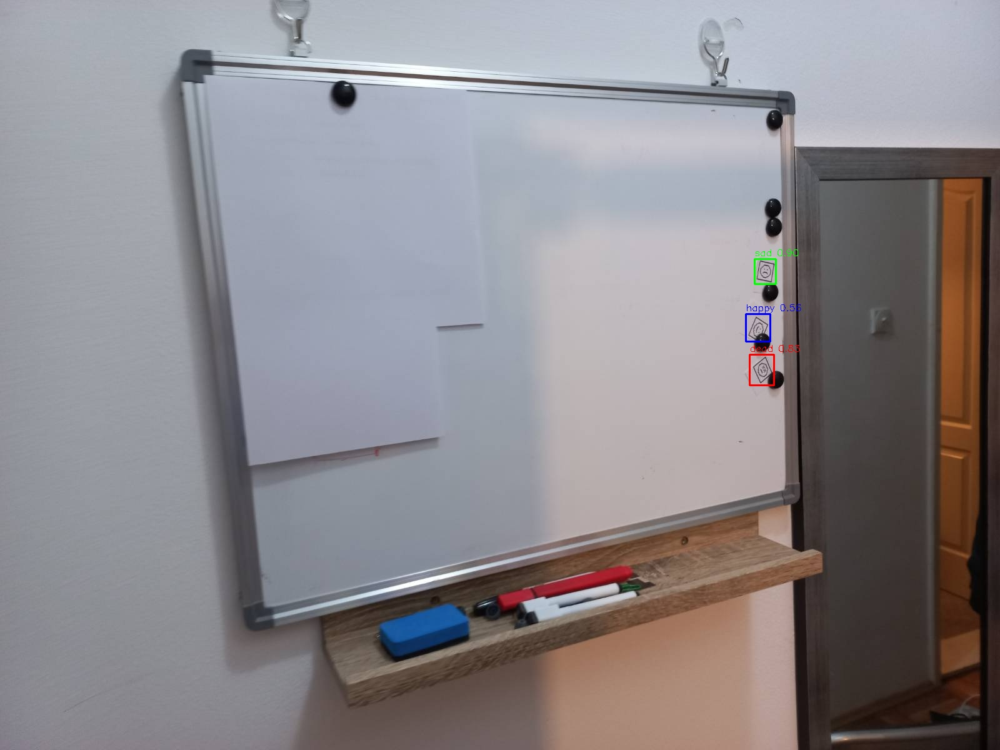

# Sticker Detection Project 🎯

This project is designed to **train and run an object detector** based on YOLOv8 to recognize three types of sticker faces: `happy`, `sad`, and `dead`.  
The model is trained **exclusively on synthetically generated images**, created from a small set of class-specific base icons.

## 🖼️ Sticker Classes

Below are the sticker class icons used for dataset generation:

<p align="center">
  
  
  
</p>

## ⚙️ Environment Setup

This project was developed and tested with the following setup:

- Python: `3.8.10`
- CUDA: `12.4`
- GPU: `Tesla T4`

## 📁 Project Structure

```bash
.
├── backgrounds/               # Backgrounds for synthetic data (created after running preparation script)
├── dataset/                   # Auto-generated dataset (images + labels in YOLO format)
│   ├── images/
│   └── labels/
├── inference_images/          # Real images for evaluation
├── runs/                      # YOLO training results
├── stickers/                  # Source stickers for data generation
│   ├── dead/
│   └── happy/
│   └── sad/
│   ├── dead.png
│   ├── happy.png
│   └── sad.png
├── download_coco.py           # Script to download COCO images for backgrounds
├── dataset_preparation.py     # Script to generate synthetic dataset
├── train.py                   # YOLO training launcher
├── test.py                    # Inference on test set
├── hybrid_inference.py        # Combined sliding-window + resize inference
├── requirements.txt           # Project dependencies
└── README.md
```

---

## 🧪 How to Reproduce

1. **Clone the repository**

```bash
git clone https://github.com/ryan-goosling/sticker_detection.git
cd sticker_detection
```

2. **Install dependencies**

```bash
pip install -r requirements.txt
```

3. **Prepare data**

```bash
python download_coco.py
python dataset_preparation.py
```

4. **Train the model**

```bash
python train.py
```

5. **Run inference**

```bash
python test.py inference_images results
```

---

## 💡 Features

- Training without real labeled data
- Photorealistic sticker placement on diverse backgrounds
- Customizable augmentation pipeline (blur, color jitter, perspective, motion blur, etc.)
- Hybrid inference with sliding-window + resize fusion
- Class balancing and label deduplication strategies

---

## 📊 Results

The final model was evaluated on a held-out, synthetically generated test set of 200 images containing 420 total instances.

| Metric   | Value |
|----------|-------|
| Precision | **0.9615** |
| Recall    | **0.9553** |
| mAP@0.50  | **0.9872** |
| mAP@0.50:0.95 | **0.8485** |

**Per-class performance:**

- `happy`: mAP@0.5 = 0.987, mAP@0.5:0.95 = 0.857  
- `sad`: mAP@0.5 = 0.981, mAP@0.5:0.95 = 0.838  
- `dead`: mAP@0.5 = 0.993, mAP@0.5:0.95 = 0.851  

These results demonstrate the model's high precision and recall, even on synthetic test samples with photorealistic augmentations.

### 🖼️ Example Inference Results

<p align="center">
  
  
  
</p>

*Predicted bounding boxes for sticker detection across diverse real-world scenes.*


---

## 📋 Ideas for improvement

- [ ] Improve model performance on very big/small objects
- [ ] Add support for instance segmentation
- [ ] Evaluate on real-world datasets
- [ ] improve the postprocessing logic.
- [ ] try to find roi using segmentation, and then detect and train the model for classification
- [ ] fix incorrect markup generation after perspective deformations and augmentations
- [ ] add overlapping objects to the generation

---

## 📬 Contact

For questions or collaboration, feel free to reach out via GitHub issues or open a PR.
